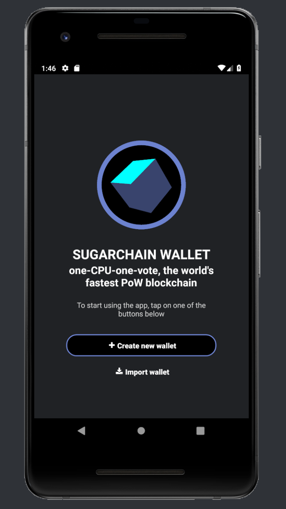
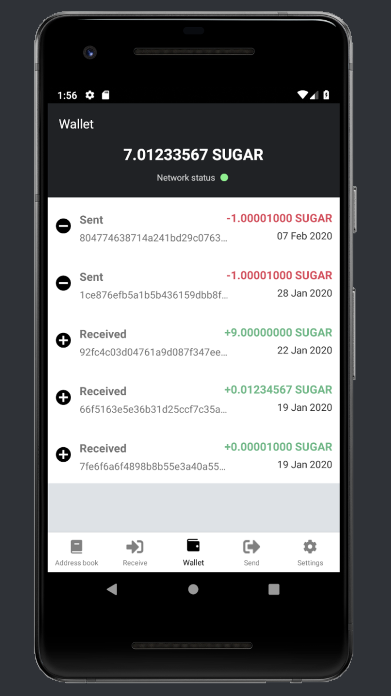

# ANDROID WALLET FOR SUGARCHAIN

### Keywords
- Wallet
- Sugarchain
- NativeSegwit

### Description
When cute dreams become daily life, Sugarchain Wallet.

The Sugarchain Wallet can store and exchange Sugarchains (SUGAR) between its users in a more safe and secure manner. It is designed for faster and more secure Sugarchain transactions allowing for a truly peer-to-peer micro-payments platform.

Key wallet features include:
- Send or receive Sugarchain (SUGAR)
- Create new or import existing wallets
- Label your wallets with names
- Secure each wallet with a password
- Manage existing wallets
- View your transaction history of each wallet
- Generate new receiving addresses
- Quick fee estimator to assist with fees

Simple key features make it easy for anyone to simply send and receive Sugarchain between peers.

If there're any issues please join the official Telegram: https://t.me/sugarchain for further assistance.

### Screenshot
- Main Page

- Transaction Page

